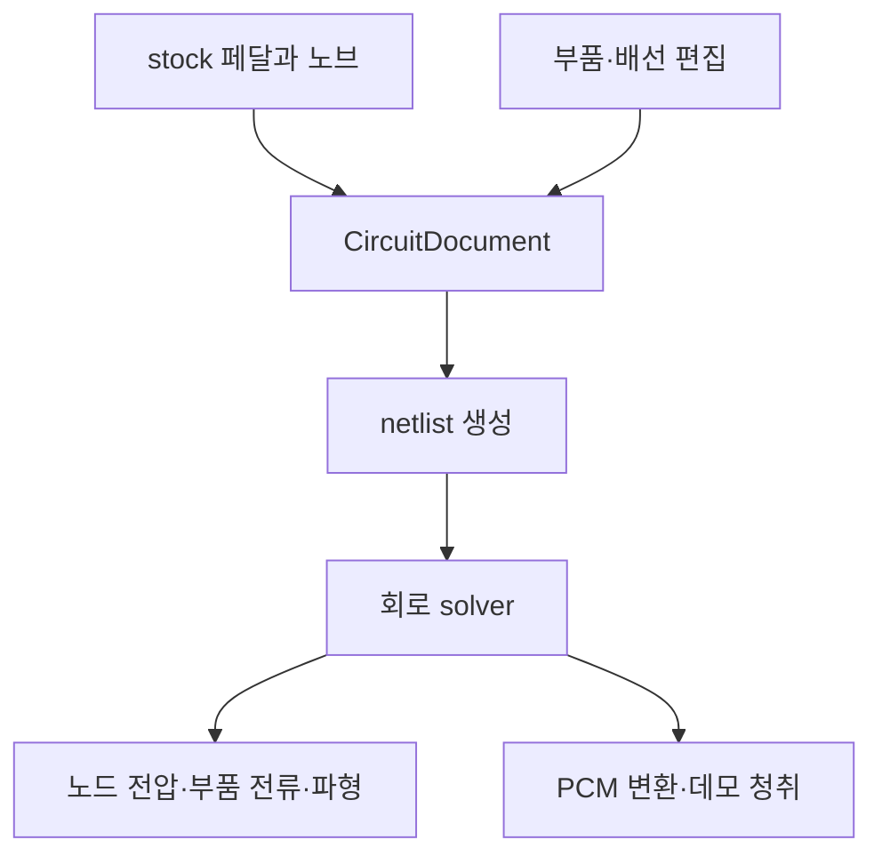

# 아키텍처 초안

상태: 제안. 아직 구현된 시스템은 아니며, 2026-10-08 사용자 리뷰의 실제 회로 시뮬레이션·프레임·케이블·회로 편집 목표를 반영했다.

## 전체 구조

| 계층 | 책임 |
| --- | --- |
| React 화면 | Workspace의 배치·선택·실물 사진·조절값, 파형과 계산 상태 |
| 배치 데이터 | 프레임·페달의 좌표와 소속. 전기적 연결과 분리. |
| 회로 데이터 | 부품, net, 외부 port, 물리 노브 binding, 부품 모델과 revision |
| 회로 조립기 | 이후 패치 케이블로 여러 페달 port를 연결해 하나의 회로 생성 |
| netlist 생성기 | 같은 CircuitDocument를 ngspice 입력으로 전개 |
| Web Worker + ngspice/WASM | DC·AC·transient 계산, 원시 전압·전류 및 PCM 생성 |
| Web Audio 재생 | 계산 결과를 재생하고 별도 monitor 볼륨 관리 |
| native ngspice 검증 | 개발·검증 환경에서 같은 회로의 기준 파형·측정 자료 생성 |
| GitHub·GCP Nginx | source 관리 및 특정 commit의 앱·WASM·모델 정적 자원 배포 |

## stock과 커스텀의 공통 경로

회로 편집 UI는 후속 단계지만 처음부터 같은 문서를 사용한다. 사용자에게 보이는 회로도 기호의 배치와 실제 net 연결도 구분한다. 실물 사진을 움직이는 동작이 내부 net을 바꾸지 않는다.

## 회로와 제어

노브를 변경하면 binding이 실제 가변저항의 gang·taper·저항망을 변경한다. solver가 전원·바이어스와 부품의 비선형·시간 상태를 계산한다. stock 회로의 OFF도 원 electronic bypass를 계산한다. 임의의 원음 경로만 연결해 대체하지 않는다.

기준 회로 source·정정·부품 모델·engine 설정을 revision과 hash로 기록한다. 파형은 monitor 처리 이전의 실제 volts·amps·time 값이다. 실물 검증 상태도 회로 수치 검증과 별도로 유지한다.

## 계산과 UI 생명주기

첫 모드는 짧은 데모를 Worker에서 계산한 뒤 재생한다. 요청 설정, 완료된 설정, job ID를 따로 관리한다. 지난 job은 새 상태를 덮어쓸 수 없다. 계산 실패·미수렴·취소를 사용자에게 표시한다.

engine과 소스는 화면 render마다 새로 만들지 않는다. 삭제·재추가·빠른 노브 변화에서 job·Worker·재생 buffer를 정리한다. 회로 상태는 audio chunk마다 초기화하지 않는다.

후속 연속 재생은 solver Worker와 AudioWorklet을 queue로 연결한다. 처리량·buffer·파라미터 변경·state 보존을 통과한 환경에만 활성화한다. 자세한 단계와 오차 기준은 [회로 plan](../01-plan/26-10-08.bd2-circuit-simulation.plan.md)에 있다.

## 외부 장치 연결

[도메인 모델](domain-model.md)의 Frame은 기계적 객체다. 케이블은 실제 장치 port와 반환 경로를 연결한다. 여러 페달을 연결하면 다음 페달의 입력 부하·전원·접지가 이전 페달 동작에 미치는 영향도 전체 회로에서 계산한다. 독립 PCM 함수의 순차 호출만으로 모든 loading을 재현했다고 하지 않는다.

## 배포와 운영

특정 commit의 정적 앱·WASM·모델을 Nginx로 제공한다. 무거운 native 테스트·WASM build는 운영 VM의 기존 서비스와 분리된 개발 환경에서 수행한다. `main`의 특정 SHA를 새 release로 검증하고 current를 전환한다. [운영 초안](../05-operations/deployment.md)을 따른다.

첫 WASM은 Worker에서 실행하는 단일 thread 구성을 우선 검증한다. 후속 pthread/shared memory 경로를 선택하면 COOP/COEP와 same-origin 자원에 대한 설정·browser 호환을 별도 plan으로 적용한다. 첫 기반 배포에 미승인 header 변경을 추가하지 않는다.
